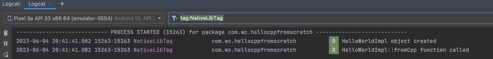

# HelloAndroid
[TOC]


## 1、第一个Android应用

### (1) 下载Android Studio

在官方网址(https://developer.android.com/studio)下载Android Studio，它是一个专门适用于Android开发的IDE。


### (2) 创建Android工程

打开Android Studio，选择File > New > New Project...，在弹出提示框中选择“Empty Activity”模板，Android Studio会创建一个带部分代码的工程。可以参考这篇Android官方文档[^1]，创建个HelloWorld应用。后面提到的Android工程，都是指Android Studio创建的工程。

> 示例工程，见HelloWorld

这里主要介绍Android应用的工程结构。

工程根目录下面主要是下面文件夹和文件

```shell
$ tree . -L 1
.
├── app
├── build
├── build.gradle
├── gradle
├── gradle.properties
├── gradlew
├── gradlew.bat
├── local.properties
└── settings.gradle
```

主要开发的代码在app文件夹下，如下

```shell
$ tree app -L 1
app
├── build
├── build.gradle
├── libs
├── proguard-rules.pro
└── src
```

* src放源码
* libs放依赖库
* build放编译的产物

再看看src下面的内容，如下

```shell
$ tree app/src -L 1 
app/src
├── androidTest
├── main
└── test
```

Android Studio默认创建三个部分的代码

* main文件是app的开发代码所放位置
* test文件是单元测试代码的所放位置。它的测试代码运行在本机上
* androidTest文件是app测试代码的所放位置。它的测试代码运行在android设备上。

更详细看下src的结构，如下

```shell
$ tree app/src     
app/src
├── androidTest
│   └── java
│       └── com
│           └── wc
│               └── helloworld
│                   └── ExampleInstrumentedTest.kt
├── main
│   ├── AndroidManifest.xml
│   ├── java
│   │   └── com
│   │       └── wc
│   │           └── helloworld
│   │               ├── MainActivity.kt
│   │               └── ui
│   │                   └── theme
│   │                       ├── Color.kt
│   │                       ├── Theme.kt
│   │                       └── Type.kt
│   └── res
│       ├── ...
└── test
    └── java
        └── com
            └── wc
                └── helloworld
                    └── ExampleUnitTest.kt
```

在上面三个文件夹下面，代码都放在java文件夹下面，并以java文件夹为根目录，按照java包的方式（例如com/wc/../xxx.kt）管理kt源文件。

说明

> 如果还有其他语言，和java同级，还有其他文件夹，例如cpp，用于Android上C++开发


## 2、使用C++代码

在Android开发中可以使用C/C++代码开发，Android系统提供NDK(Native Development Kit)工具，它是包含一套工具，包括JVM虚拟机支持调用C++代码、JNI接口定义规范，以及编译C/C++的工具CMake和ndk-build等。

在Android Studio中现在默认使用CMake工具，而废弃ndk-build工具[^2]（在早期Android Studio工程还可以看到ndk-build相关配置文件，例如Android.mk文件）。

一般需要使用NDK开发有两种情况[^2]

* 为了性能考虑，计算密集型的执行，使用C/C++实现，性能比Java快
* 复用已有的C/C++库

后面提到的NDK开发特指Android上C/C++开发


### (1) Android应用编译C++源码

为了清楚介绍，Android工程如何集成和配置编译成C++源码，这里不采用Native C++模板，而是新建工程采用“Empty Activity”模板，它不带任何C++相关的配置。

说明

> 新建工程，在Phonen and Tablet下面选择Native C++这个模板，C++ Standard选择Toolchain Default。创建好的工程，默认已经有C++代码和使用JNI接口的kotlin代码。如果了解清楚C++相关配置文件，可以采用这个方式快速搭建C++开发。

> 示例工程，见HelloCppFromScratch


#### a. 准备cpp源码文件夹

在main文件夹新建cpp文件夹，并把C++源码放在这个文件夹下。

举个例子，如下

```shell
$ tree app/src/main/cpp 
app/src/main/cpp
├── helloNativeLib.cpp
└── helloNativeLib.hpp
```

helloNativeLib.hpp，内容如下

```c++
#pragma once

#include <memory>
#include <string>

namespace HelloNativeLib {

class HelloWorld {
public:
    virtual ~HelloWorld() {}

    static std::shared_ptr<HelloWorld> create();

    virtual std::string fromCpp() = 0;
};

}  // namespace HelloNativeLib
```

helloNativeLib.cpp，内容如下

```c++
#include "helloNativeLib.hpp"

using namespace HelloNativeLib;

class HelloWorldImpl : public HelloWorld {
public:
    // Note: should re-declare again for static member function
    static std::shared_ptr<HelloWorld> create();
    // Note: should re-declare again for pure virtual function
    std::string fromCpp() /*override*/;
};

std::shared_ptr<HelloWorld> HelloWorld::create() {
    return std::make_shared<HelloWorldImpl>();
}

// Override the pure virtual function in super class
std::string HelloWorldImpl::fromCpp() {
    return "Hello From C++!";
}
```


#### b. 配置CMakeLists.txt

在cpp文件夹下，添加CMakeLists.txt，注意一定是这个命名。

它的内容，如下

```cmake
# Sets the minimum version of CMake required to build your native library.
# This ensures that a certain set of CMake features is available to
# your build.
cmake_minimum_required(VERSION 3.22.1)

# Declares and names the project.
project("helloNativeLib")

# Specifies a library name, specifies whether the library is STATIC or
# SHARED, and provides relative paths to the source code. You can
# define multiple libraries by adding multiple add_library() commands,
# and CMake builds them for you. When you build your app, Gradle
# automatically packages shared libraries with your APK.

add_library( # Specifies the name of the library.
        helloNativeLib

        # Sets the library as a shared library.
        SHARED

        # Provides a relative path to your source file(s).
        helloNativeLib.cpp )

# Specifies a path to native header files.
include_directories(src/main/cpp/include/)

find_library( # Defines the name of the path variable that stores the
        # location of the NDK library.
        log-lib

        # Specifies the name of the NDK library that
        # CMake needs to locate.
        log )

# Links your native library against one or more other native libraries.
target_link_libraries( # Specifies the target library.
        helloNativeLib

        # Links the log library to the target library.
        ${log-lib} )
```

关于上面的字段可以参考这篇官方文档[^3]。这里介绍部分字段

* cmake_minimum_required，用于配置CMake的最低版本，保证使用特定feature功能。
  * 这里的最低版本号，可以参考Android Studio的Native C++模板中的CMakeLists.txt
* project，定义CMake工程的名字。这个是必选字段。
* add_library，定义一个库，它有三个参数
  * 第一个参数，是库的名字。这里命名为helloNativeLib
  * 第二个参数，设置STATIC或者SHARED，即静态库或者动态库（也称为共享库）
  * 第三个参数，C++源文件的路径，即cpp文件的路径，可以有多个。注意：相对路径是指相对于CMakeLists.txt文件。
* include_directories，指定C++头文件的搜索路径。如果有很多公共头文件，可以放在这个路径下面，然后在cpp文件中，使用双引号方式引入
* find_library，用于指定C++依赖库，如果自己开发的C++代码，需要其他的C++库，则使用这个字段。
  * 第一个参数，用于定义一个依赖库的名字，这里是log-lib。
  * 第二个参数，实际要依赖库的名字，这里是log。它是NDK API[^5]提供的C++库。

* target_link_libraries，用于建立依赖关系
  * 第一个参数，用于定义target libray。这里是helloNativeLib
  * 第二个参数，用于定义依赖库的名字，它是个引用的名字，使用`$`引用。这里是${log-lib}

> 关于更多CMake字段的使用，参考CMake文档[^4]


#### c. 配置gradle

完成上面CMakeLists.txt的配置，需要在build.gradle文件中配置下，让gradle能执行cmake。配置内容[^6]，如下

```groovy
android {
    ...
    
    // Encapsulates your external native build configurations.
    externalNativeBuild {
        // Encapsulates your CMake build configurations.
        cmake {
            // Provides a relative path to your CMake build script.
            path file('src/main/cpp/CMakeLists.txt')
        }
    }
}

```

这里的CMakeLists.txt相对路径，是相对于build.gradle文件

完成上面配置，可以尝试编译下C++代码。

在Android Studio中，选择Build > Build Bundle(s)/APK(s) > Build APK(s)，在Android Studio找到Build tab，查看编译信息。如果编译成功，会看到最后的信息，如下

```shell
...
BUILD SUCCESSFUL in 3s
35 actionable tasks: 10 executed, 25 up-to-date

Build Analyzer results available
```

如果要确认apk中，是否包含C++的动态库[^7]，可以在Android Studio中，选择Build > Analyze APK...，在弹出框中选择apk，Android Studio会显示，如下


可以看到在apk的lib文件夹下，有不同CPU架构的文件夹，下面对应刚才CMakeLists.txt命名的helloNativeLib，在CMake编译约定中，库的命名按照lib{library-name}.so格式。

可以找到刚才Android Studio打开apk的位置，它位于app/build/outputs/apk/debug下面，解压这个apk文件（修改后缀名为zip然后解压），查看下面4个so文件的架构，如下

```shell
$ cd app/build/outputs/apk/debug/app-debug.apk/lib
$ file x86/libhelloNativeLib.so 
x86/libhelloNativeLib.so: ELF 32-bit LSB shared object, Intel 80386, version 1 (SYSV), dynamically linked, BuildID[sha1]=6f70d07d04d01f433b18c235b72540d688fe72b2, stripped
$ file x86_64/libhelloNativeLib.so
x86_64/libhelloNativeLib.so: ELF 64-bit LSB shared object, x86-64, version 1 (SYSV), dynamically linked, BuildID[sha1]=c6222516d55dde744009a899004e761e98e85b33, stripped
$ file arm64-v8a/libhelloNativeLib.so 
arm64-v8a/libhelloNativeLib.so: ELF 64-bit LSB shared object, ARM aarch64, version 1 (SYSV), dynamically linked, BuildID[sha1]=2e0616b4ac48c9b63007a511d2f41ca29eefe405, stripped
$ file armeabi-v7a/libhelloNativeLib.so 
armeabi-v7a/libhelloNativeLib.so: ELF 32-bit LSB shared object, ARM, EABI5 version 1 (SYSV), dynamically linked, BuildID[sha1]=88195ed3af37ea69309c2f035a17e3552cc6822a, stripped
```

可见Android Studio编译so为32位和64位，同时支持模拟器和真机架构，而且so文件不同于iOS/MacOS上的MachO格式，它是ELF格式。

> 使用`objdump -x libhelloNativeLib.so`，可以查看更详细的二进制信息


#### d. 加载C++动态库

在调用C++接口之前，需要加载C++动态库。

如果是Kotlin，加载方式，如下

```kotlin
class MainActivity : ComponentActivity() {
  ...
  companion object {
      init {
          System.loadLibrary("helloNativeLib");
      }
  }
}
```

如果是Java，加载方式，如下

```java
static {
    System.loadLibrary("helloNativeLib");
}
```

注意：loadLibrary函数的参数是动态库的名字，而不是动态库的文件名


#### e. 使用JNI接口

JNI(Java Native Interface)是Java虚拟机提供Java调用C++代码的一种方式，它属于Java虚拟机的能力，和Android系统没有关系。

> 如果要详细学习JNI的能力，可以参考Java的官方文档[^8]

这里直接参考Android的文档[^9]，介绍如何使用JNI接口。

实际上，Java不能直接调用C++代码，而是在Java侧声明Java函数，而C++侧定义好这个声明对应的C++实现，即JNI规范的C++函数（后面称这个函数为JNI接口），然后在这个JNI接口中，再调用自定义C++库的函数。

下面按照几个步骤，实现Java调用C++代码

* Java/Kotlin声明外部函数
* 定义JNI接口


##### Java/Kotlin声明外部函数

Kotlin的声明，如下

```kotlin
class MainActivity : ComponentActivity() {
    ...
    external fun stringFromJNI(): String
}
```

Java的声明，如下

```java
public native String stringFromJNI();
```

说明

> stringFromJNI函数的声明可以在类中，也可以文件域中。这会影响JNI接口函数的命名规则。


##### 定义JNI接口

为了代码结构清晰，这里在cpp文件夹新建一个jni.cpp，内容如下

```c++
#include <jni.h>
#include <string>
#include "helloNativeLib.hpp"

using namespace HelloNativeLib;

extern "C" JNIEXPORT jstring JNICALL
Java_com_wc_hellocppfromscratch_MainActivity_stringFromJNI(JNIEnv* env, jobject /* this */) {
    std::shared_ptr<HelloWorld> helloWorld = HelloWorld::create();
    std::string hello = helloWorld->fromCpp();
    return env->NewStringUTF(hello.c_str());
}
```

在CMakeLists.txt添加jni.cpp，如下

```cmake
add_library( # Specifies the name of the library.
        helloNativeLib

        # Sets the library as a shared library.
        SHARED

        # Provides a relative path to your source file(s).
        helloNativeLib.cpp
        jni.cpp)
```


这里简单介绍JNI规范，函数名Java_com_wc_hellocppfromscratch_MainActivity_stringFromJNI，用于Java虚拟机能将Java侧的函数声明和这里函数实现能匹配上。

* 必须使用`Java_`前缀
* com_wc_hellocppfromscratch是包路径
* MainActivity是`.java`文件或者`.kt`文件，去掉扩展名的名字。
* stringFromJNI是Java侧声明的函数名

这里`JNIEnv*` 是指向虚拟机的指针，`jobject` 是指向从 Java 端传递的隐式 `this` 对象的指针。

Java_com_wc_hellocppfromscratch_MainActivity_stringFromJNI函数返回jstring，是JNI规范定义的数据类型，它不是字符串，而是指向Java字符串的指针。使用env指针调用NewStringUTF方法，将c字符串转成jstring类型。


回到Java侧的MainActivity.kt文件，修改代码，如下

```kotlin
override fun onCreate(savedInstanceState: Bundle?) {
    super.onCreate(savedInstanceState)
    setContent {
        HelloCppFromScratchTheme {
            // A surface container using the 'background' color from the theme
            Surface(
                modifier = Modifier.fillMaxSize(),
                color = MaterialTheme.colorScheme.background
            ) {
                var text = stringFromJNI()
                Greeting(text)
            }
        }
    }
}
```

这里调用stringFromJNI函数，将返回值传给Greeting函数。用Android Studio编译和运行app，可以看到UI上显示“Hello from C++”


#### f. 使用NDK API接口

Android的NDK提供一套C++ API[^5]，方便开发者直接调用相关C++库，例如打日志能力，这里介绍如何使用这些API。

在上面CMakeLists.txt中，已经集成NDK中一个名为log库，那么可以使用库的C++接口。

在helloNativeLib.cpp，添加下面代码，如下

```c++
#include "helloNativeLib.hpp"

#include <android/log.h>

... 

std::shared_ptr<HelloWorld> HelloWorld::create() {
    __android_log_print(ANDROID_LOG_DEBUG, "NativeLibTag", "%s object created", "HelloWorldImpl");

    return std::make_shared<HelloWorldImpl>();
}

// Override the pure virtual function in super class
std::string HelloWorldImpl::fromCpp() {
    __android_log_print(ANDROID_LOG_DEBUG, "NativeLibTag", "%s function called", "HelloWorldImpl::fromCpp");

    return "Hello From C++!";
}
```

这里导入`<android/log.h>`头文件[^10]，并调用该头文件中的`__android_log_print`，它的签名可以在NDK API手册[^11]查询到。

它的日志输出是在LogCat中，如下




### (2) Android应用集成C++动态库或静态库

如果Android应用使用的C++代码，不在Android应用中编译，而是以动态库或静态库的集成到Android应用中。那么需要下面几个步骤：

* 准备.so或者.a文件
* 创建支持C++源码编译的Android工程
* 配置Android应用的build.gradle和CMakeList.txt

其中第二步实际和直接Android Studio的Native C++模板是一样的，只不过换成手动来完成。

> 示例工程，见HelloCppVendorLibrary
>
> 

#### a. 准备.so或者.a文件

这个步骤实际是比较复杂的过程，需要将C++源码编译成Android系统上的动态库(.so文件)或者静态库(.a文件)。这里在MacOS平台上使用CMake工具来简单示例如何编译这两种文件。

CMakeLists.txt内容，如下

```cmake
# Sets the minimum version of CMake required to build your native library.
# This ensures that a certain set of CMake features is available to
# your build.
cmake_minimum_required(VERSION 3.22.1)

# Declares and names the project.
project("vendor library")

add_library( # Specifies the name of the library.
        helloSharedLib

        # Sets the library as a shared library.
        SHARED

        # Provides a relative path to your source file(s).
        helloSharedLib.cpp
        jni_helloSharedLib.cpp)

add_library( # Specifies the name of the library.
       helloStaticLib

       # Sets the library as a static library.
       STATIC

       # Provides a relative path to your source file(s).
       helloStaticLib.cpp
       jni_helloStaticLib.cpp
)

# Specifies a path to native header files.
include_directories(src/main/cpp/include/)

find_library( # Defines the name of the path variable that stores the
        # location of the NDK library.
        log-lib

        # Specifies the name of the NDK library that
        # CMake needs to locate.
        log )

## Links your native library against one or more other native libraries.
target_link_libraries( # Specifies the target library.
        helloSharedLib
        # Links the log library to the target library.
        ${log-lib} )
```

cmake命令有许多参数，为了方便，编写一个简单脚本，如下

```shell
set -x

CMAKE_HOME=~/Library/Android/sdk/cmake/3.22.1/bin
NDK=~/Library/Android/sdk/ndk/25.1.8937393
ABI=x86_64
MINSDKVERSION=33
BUILD_TYPE=Debug
OTHER_ARGS=
OUT_HOME=$(pwd)/out

rm -rf ${OUT_HOME}
mkdir ${OUT_HOME}

$CMAKE_HOME/cmake \
    -B${OUT_HOME} \
    -DANDROID_ABI=${ABI} \
    -DANDROID_PLATFORM=android-${MINSDKVERSION} \
    -DANDROID_NDK=${NDK} \
    -DCMAKE_ANDROID_ARCH_ABI=${ABI} \
    -DCMAKE_ANDROID_NDK=${NDK} \
    -DCMAKE_BUILD_TYPE=${BUILD_TYPE} \
    -DCMAKE_EXPORT_COMPILE_COMMANDS=ON \
    -DCMAKE_MAKE_PROGRAM=${CMAKE_HOME}/ninja \
    -DCMAKE_SYSTEM_NAME=Android \
    -DCMAKE_TOOLCHAIN_FILE=${NDK}/build/cmake/android.toolchain.cmake \
    -GNinja \
    -H. \
    ${OTHER_ARGS}

$CMAKE_HOME/ninja -C out
```

上面部分选项参考Android官方文档[^13]

说明

> NDK的路径，可以通过 Tools > SDK Manager > SDK Tools[^14]


#### b. 创建支持C++源码编译的Android工程

这个步骤，实际和使用C++源码编译一样，只不过这个Android工程的C++源码起到占位的作用。

有两种方式创建支持C++源码编译的Android工程[^12]

* 使用Android Studio的Native C++模板
* 手动添加C++相关文件和配置文件

这里采用第二种方式：和Native C++模板保持一致，在src/main/cpp路径下面（没有则创建对应文件夹），添加dummy.cpp文件和CMakeList.txt。

* dummy.cpp，是为了让Android Studio在apk里面生成so文件，如果没有任何源码编译，只是链接动态库或静态库，则不会有so文件
* CMakeList.txt，是提供给Android Studio，内容下面再介绍。

dummy.cpp的内容，如下

```c++
static void __dummy(void) {}
```

其实内容随便写一个内部函数，不让外部使用就行。


#### c. 配置build.gradle和CMakeList.txt

上面创建的Android工程，实际还不能支持C++编译，需要配置build.gradle和CMakeList.txt。

在Android应用工程的app文件夹下，找到build.gradle文件，添加externalNativeBuild这个gradle插件配置，如下

```groovy
android {
    ...
    externalNativeBuild {
        cmake {
            // Provides a relative path to your CMake build script.
            path file('src/main/cpp/CMakeLists.txt')
        }
    }
}
```

这里让gradle能执行cmake来编译C++，并且gradle会打包so文件到apk中。


CMakeLists.txt的内容，如下

```cmake
cmake_minimum_required(VERSION 3.22.1)

project("import vendor library")

## Step1: Add target helloStaticLib for placeholder

add_library(
        # Specifies the name of the library.
        helloStaticLib

        # Sets the library as a shared library.
        SHARED

        # Note: add a dummy cpp
        dummy.cpp)

## Step2: Add target importedSharedLib for shared library

add_library(
        # Specifies the name of the library.
        importedSharedLib

        # Sets the library as a shared library.
        SHARED

        # Note: Indicates the library file outside our project
        IMPORTED)

set_target_properties(
        importedSharedLib
        PROPERTIES
        IMPORTED_LOCATION ${CMAKE_CURRENT_SOURCE_DIR}/../../../../vendor_library/out/libhelloSharedLib.so
)

## Step3: Add target importedStaticLib for static library

add_library(
        # Specifies the name of the library.
        importedStaticLib

        # Sets the library as a shared library.
        STATIC

        # Note: Indicates the library file outside our project
        IMPORTED)

set_target_properties(
        importedStaticLib
        PROPERTIES
        IMPORTED_LOCATION ${CMAKE_CURRENT_SOURCE_DIR}/../../../../vendor_library/out/libhelloStaticLib.a
)

## Step4: Add rest targets dependency to dest target

target_link_libraries(
        helloStaticLib
        importedSharedLib
)

find_library( # Defines the name of the path variable that stores the
        # location of the NDK library.
        log-lib

        # Specifies the name of the NDK library that
        # CMake needs to locate.
        log )

target_link_libraries( # Specifies the target library.
        helloStaticLib
        # Links the log library to the target library.
        ${log-lib}
)

# @see https://stackoverflow.com/a/52952274
target_link_libraries(
        helloStaticLib -Wl,--whole-archive importedStaticLib -Wl,--no-whole-archive
)
```

* add_library，用于定义target
  * 第一个参数是target名字
  * 第二个参数是SHARED或STATIC，表示动态库或者静态库
  * 剩余参数可以特殊关键词或者源文件路径。例如IMPORTED表示该target是外部导入的库

* target_link_libraries，用于确定目标target的依赖关系
  * 第一个参数是目标target，一般是可执行文件。这个目标target也需要通过add_library来定义。
  * 剩余参数是依赖的target。
* set_target_properties，用于设置target属性
  * 第一个参数是target名
  * 第二个参数是PROPERTIES
  * 第三个参数是属性的KV
* find_library，用于查询Android系统库，并定义变量名。例如这里查询log，并定义变量名为log-lib


#### d. 加载C++动态库和调用JNI函数

加载C++动态库和调用JNI函数，和使用C++源码编译是一样的，这里不再赘述。


## 3、Android常见任务

### (1) 查看so文件的符号信息

Android上so文件是ELF格式，不能使用nm命令。使用objdump命令可以查看ELF格式。


#### a. 符号表(symbol table)和动态符号表(dynamic symbol table)

so文件中为符号表(symbol table)和动态符号表(dynamic symbol table)，一般符号表没有符号信息，如下

```shell
$ objdump -t libhelloSharedLib.so 

libhelloSharedLib.so:	file format elf64-x86-64

SYMBOL TABLE:
```

使用`-t`选项，可以查看符号表(symbol table)，可以看到上面libhelloSharedLib.so的符号表没有内容。

使用`-T`可以查看动态符号表(dynamic symbol table)，`-C`用于demangle符号[^15]。举个例子，如下

```shell
$ objdump -TC libhelloSharedLib.so | grep Java_com
0000000000025560 g    DF .text	00000000000000dd              Java_com_wc_hellocppvendorlibrary_MainActivity_stringFromHelloSharedLib
$ objdump -TC libhelloStaticLib.so | grep Java_com 
0000000000006740 g    DF .text	00000000000000dd              Java_com_wc_hellocppvendorlibrary_MainActivity_stringFromHelloStaticLib
```

上面搜索2个JNI函数的符号：Java_com_wc_hellocppvendorlibrary_MainActivity_stringFromHelloSharedLib和Java_com_wc_hellocppvendorlibrary_MainActivity_stringFromHelloStaticLib

这种方式常用于Android NDK开发过程中检查apk中so文件，是否集成特定的C/C++函数符号。


## 4、常用文档地址

### (1) 下载Android Studio

https://developer.android.com/studio


### (2) Kotlin学习官网

https://kotlinlang.org/docs/getting-started.html


### (3) Android Kotlin 基础知识

https://developer.android.com/courses/kotlin-android-fundamentals/overview?hl=zh-cn


## References

[^1]:https://developer.android.com/codelabs/basic-android-kotlin-compose-first-app?continue=https%3A%2F%2Fdeveloper.android.com%2Fcourses%2Fpathways%2Fandroid-basics-compose-unit-1-pathway-2%23codelab-https%3A%2F%2Fdeveloper.android.com%2Fcodelabs%2Fbasic-android-kotlin-compose-first-app&%3Bhl=zh-cn&hl=zh-cn#0
[^2]:https://developer.android.com/ndk/guides?hl=zh-cn
[^3]:https://developer.android.com/studio/projects/configure-cmake?hl=zh-cn
[^4]:https://cmake.org/cmake/help/latest/index.html
[^5]:https://developer.android.com/ndk/reference
[^6]:https://developer.android.com/studio/projects/gradle-external-native-builds?hl=zh-cn#groovy
[^7]:https://developer.android.com/studio/projects/add-native-code?hl=zh-cn
[^8]:https://docs.oracle.com/javase/7/docs/technotes/guides/jni/spec/jniTOC.html
[^9]:https://developer.android.com/ndk/samples/sample_hellojni?hl=zh-cn
[^10]:https://stackoverflow.com/questions/19186915/cant-include-ndk-header-files
[^11]:https://developer.android.com/ndk/reference/group/logging

[^12]:https://bowser-f.medium.com/link-c-c-library-dependencies-to-your-own-c-c-code-in-an-android-application-using-cmake-79a165202ff9
[^13]:https://developer.android.com/ndk/guides/cmake?hl=zh-cn#build-command
[^14]:https://developer.android.com/studio/projects/install-ndk?hl=zh-cn
[^15]:https://stackoverflow.com/questions/34732/how-do-i-list-the-symbols-in-a-so-file

